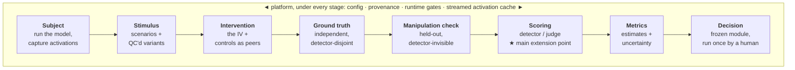
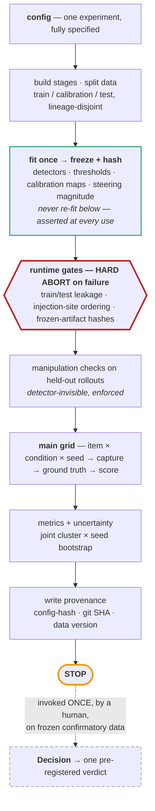

# Architecture: the evaluation pipeline

*This is a **design** document. It describes the intended architecture of the study's
harness — a config-driven pipeline over a fixed engine — and states plainly how much of it
exists today. Stage 0 (the measurement and statistics core) is built and implements the
design's primitives; the engine that composes them into the full pipeline is designed here
and built with the confirmatory study, not before. The "What exists today" section below is
explicit about the line between the two.*

## The idea

An experiment should be a configuration, not a program: a fixed engine runs a fixed
sequence of stages, and a config chooses which implementation fills each one. Place the
boundaries well and a new evaluation becomes a new config — at most one new scorer — rather
than a rewrite. That is the target the interfaces below are shaped for. Today the primitives
exist and are validated; composing them into the engine is the next build.

## The pipeline (the design)

The intended order is fixed. A subject model is run under an intervention, and what it
produces — final text, reasoning trace, internal activations — is captured. Ground truth is
established independently, by a protocol that can label an item even under the active
intervention. Manipulation checks run on held-out material no detector sees. The captured
runs are scored; scores become metrics with uncertainty; and a frozen decision module —
invoked once, by a human — turns the metrics into a single pre-registered verdict. Each
stage has one job:

- **Subject** — run the model and capture what it produced, activations included
  (streamed to disk).
- **Stimulus** — the scenarios and their quality-controlled variants (the matched
  eval / deployment / neutral triplets).
- **Intervention** — the independent variable, with control conditions as first-class peers.
- **Ground truth** — an independent verdict on each item, disjoint from anything a detector
  reads.
- **Manipulation check** — held-out, detector-invisible confirmation the intervention did
  what it claims.
- **Scoring** — the detector or judge that turns a captured run into a number; the one
  boundary most experiments extend.
- **Metrics** — point estimates and calibrated uncertainty; the headline is a difference
  between conditions.
- **Decision** — the frozen module mapping the metrics to exactly one pre-registered outcome.

## The integrity mechanisms

The design's real content is a small set of guarantees that protect a result from the
experimenter — the reason the engine is worth building at all:

- **Fit once, then freeze.** Everything learned — detectors, thresholds, calibration maps,
  the steering magnitude — is fit once on a designated split, hashed, and never re-fit, with
  hash-equality asserted at every use. Re-fitting per condition would let the manipulation
  leak into the instrument.
- **Runtime gates that hard-abort.** Before any result is produced: train/test separation
  (by scenario lineage), injection-site ordering for steering (an intervention acts *below*
  the layers a probe reads; corroborative variants above; a same-site condition exists only
  as a known-answer null), and frozen-artifact hashes.
- **A label–detector firewall.** Ground-truth elicitations and manipulation-check rollouts
  never reach any detector — a structural invariant, not a convention.
- **A human decision gate.** The decision module is never run automatically; a human invokes
  it once, on frozen confirmatory data, after verifying the gates. The engine stops one step
  short of a verdict — because the same engine also runs exploratory pilots, and
  auto-running the decision would let a pilot contaminate the result.
- **Provenance on every number.** Config hash + git SHA + data version, re-runnable from the
  config.

## The engine loop (the design)

One pass, in order: build the stages from config and split the data (disjoint by scenario
lineage); fit and freeze everything learnable; run the hard-abort gates; run the
manipulation checks on held-out rollouts; sweep the main grid; compute metrics with the
joint cluster-and-seed bootstrap; write provenance — then stop.

## What exists today, and what doesn't

The sections above describe the design. This is the honest line between what is built and
what is not.

**Built (Stage 0) — the primitives, validated:**
- The statistics and metrics core — the joint cluster × seed bootstrap, operating
  thresholds, metric definitions (`src/metrics/`).
- Streaming activation extraction and an on-disk cache (`src/models/`): the design's "stream
  to disk, never hold the full set in RAM" is real.
- The fit-once-freeze-hash pattern, implemented for a linear probe and exercised end-to-end
  by the Stage-0b pipeline validation — fits per seed, emits a content hash
  (`src/detectors/`).
- Provenance primitives — config-hash and git-SHA (`src/provenance.py`).
- The Stage-0 scripts (`src/analysis/`): independent reproduction of published detectors,
  end-to-end validation of the activation pipeline on a small synthetic dataset, and the
  power simulation.

**Designed, not built — the engine:**
- The composition loop and config-driven stage construction. There is no `run_experiment`
  yet; today's Stage-0 code is direct scripts, one per validated primitive.
- The stage abstractions as composable plug-ins — Stimulus, Intervention, Ground truth,
  Manipulation check, and the full Scoring battery.
- The three runtime gates and the label–detector firewall as an enforced engine layer.
- Cross-condition frozen-artifact assertion (the pattern exists for one probe; engine-wide
  enforcement does not).
- The frozen decision module.

Stage-0's job is to de-risk the primitives, and direct scripts are the right tool for
that. The config-driven engine only earns its keep for the confirmatory run, where many
conditions × seeds make fit-once and the gates load-bearing — which is why it is the next
build, not this one.

## Build discipline

This is why only the primitives exist so far, and it is deliberate. Design the boundaries;
build only what the current stage needs. Well-placed seams are cheap — they are just
separation of concerns — and they are what will let the confirmatory engine reuse these
primitives instead of forcing a rewrite. Building the engine early (or worse, a general
platform: a plug-in registry, a config DSL, arbitrary-model support) before the confirmatory
study needs it would spend a finite runway on generality nothing yet uses. The test for
whether an abstraction earns its place *now*: does it make the current stage clearer, or
cheaply buy a near-certain next need? Let the engine harden when the confirmatory run
demands it — not before.

## Status and caveats

- Stage 0 (the measurement and statistics core) is built and validated; the confirmatory
  engine and stages are designed here and built with Stages A–C.
- The ground-truth protocol and the steering-intervention boundary are the parts of the
  design most likely to move; both are flagged for expert review in the pre-registration
  ([`PREREGISTRATION.md`](PREREGISTRATION.md) §6, §19).
