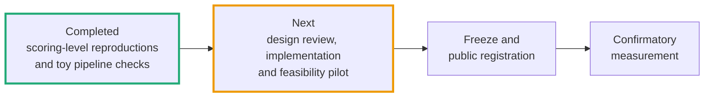
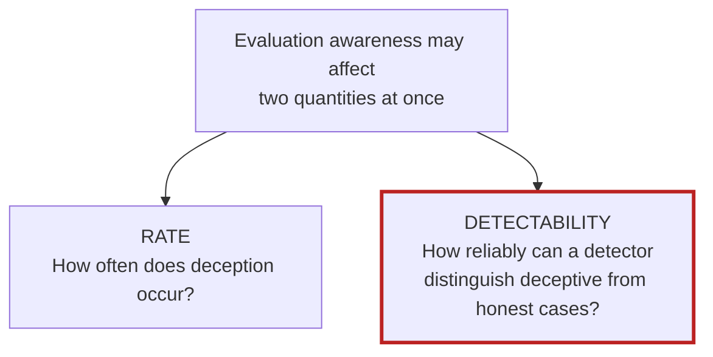
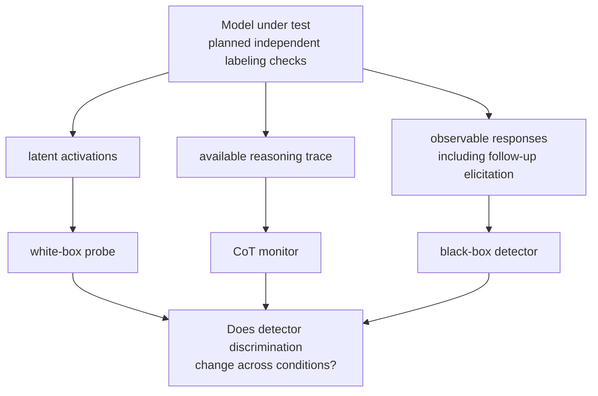
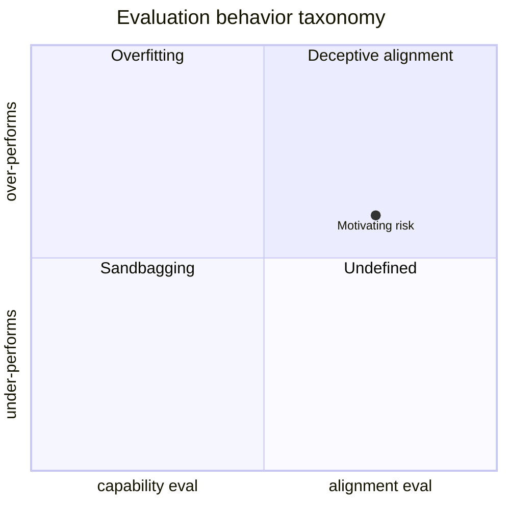

# veritas-eval

## The question

**Can we still detect an AI's deception once it knows it is being evaluated?**

An independent study of how evaluation conditions affect the reliability of
deception detectors.

## Status

**Completed reproduction and pipeline-validation work; confirmatory study in
development.** The protocol is a draft, not yet frozen or formally registered.
There is no result yet on whether evaluation awareness degrades detection.

**Completed work:**

- **Stage 0a:** independently recomputed metrics from Apollo's released example
  scores, matching the shipped results within 3e-8. Confirmed the mechanism of a
  **known** threshold-calibration discrepancy; this was not a reproduction of the
  paper's full model-generation pipeline or exact headline run.
- **Stage 0b:** validated an activation-to-probe-to-metrics pipeline on
  **Gemma-2-2B using 120 toy items**, including streaming extraction and
  known-answer steering tests. The toy data are not a deception model organism.
- **Stage 0c:** reproduced the Pacchiardi detector's canonical notebook AUCs
  from **released feature files**, within 2.4e-5, using independent fitting and
  metric implementations.

Reports, scope limits and reproduction commands are in
[`results/stage0a/`](results/stage0a/),
[`results/stage0b/`](results/stage0b/) and
[`results/stage0c/`](results/stage0c/).

**Next steps:** resolve the multi-seed estimator choice and power-simulation
discrepancies; obtain expert review of the identification and inference design;
implement and pilot the awareness manipulations, belief checks and model
organisms; then finalize, freeze and publicly register the protocol before
confirmatory data collection. Pilot data would remain separate from the
confirmatory analysis. Stages A, B and C have not started; Stage A is the proposed
exploratory feasibility pilot.

**Compute funding would support this next phase:** model runs for feasibility
checks, activation extraction and steering, plus judge/API costs for labeling and
manipulation checks. Funding and domain review are needed alongside remaining
engineering and statistical work.



<details>
<summary>Detailed component status</summary>

| Component | State |
|---|---|
| Metrics, thresholds, provenance and bootstrap machinery | Implemented components with tests and supporting simulations; multi-seed estimator semantics and confirmatory integration remain unresolved. |
| Stage 0a: Apollo scoring-level reproduction | Complete; max absolute difference 2.86e-8 against the shipped results table. |
| Stage 0b: activation-to-probe pipeline | Complete at Gemma-2-2B toy-data scale; not a deception baseline or awareness experiment. |
| Stage 0c: Pacchiardi scoring-level reproduction | Complete; canonical notebook AUCs matched within 2.36e-5 from released features. |
| F17 power simulation | First pass failed its validation target; its power estimates are not decision-grade. See the [caveat and subsequent corrections](results/power_firstpass/first_pass_caveat.md). |
| Awareness manipulations, manipulation checks and belief-verified organisms | Specified in the draft protocol; not yet implemented and piloted. Generic steering hooks have been tested. |
| Protocol freeze and public registration | Pending. |
| Stages A / B / C | Not started; exploratory pilot precedes confirmatory measurement. |

</details>

---

## Why it matters

Evaluation awareness can influence model behavior. In a **Sonnet 4.5 blackmail
scenario**, Gurnee et al. found that ablating representations associated with
recognition of the evaluation reduced verbalized awareness and increased
blackmail attempts. This is evidence from a specific intervention experiment,
reported in [*Verbalizable Representations Form a Global Workspace in Language
Models* (6 July 2026)](https://transformer-circuits.pub/2026/workspace/index.html).

That finding motivates a separate measurement question:

> **When a model is being deceptive, does its awareness of evaluation make that
> deception harder to detect?**



Both quantities matter for safety. A model that suppresses misbehavior during a
test can conceal deployment risk; a detector that misses deception can also
mislead an evaluator. One candidate mechanism is recognition of the test changing
the perceived stakes and how deception is expressed. That is a hypothesis to
investigate, not an established three-step account of all deceptive behavior.

### The stakes

If evaluation awareness changes detector performance, reliability depends on the
conditions under which detection is measured. The proposed study would estimate
that dependence under controlled conditions and test specified alternative
explanations.

**A detection change alone would not establish whether an evaluation overstates
or understates deployment reliability.** That requires additional evidence about
deployment behavior, awareness and distribution shift. Likewise, failure to find
degradation would support a bounded robustness claim only if the protocol's
equivalence, validity and power criteria pass.

The intended contribution is a controlled measurement and a reusable account of
its limits. The [July 2026 literature review](RESEARCH_REVIEW.md) did not identify
the exact proposed experiment; that assessment needs updating before renewed
novelty claims or substantial new experiments.

---

## What we propose to measure

The draft compares three detector families using different observable signals.
Their sensitivity to evaluation conditions may differ. The diagram describes the
**planned study**, not a completed evaluation system.



| Observable / detector | Proposed measurement | Important alternative explanation or limitation |
|---|---|---|
| **Activations / white-box probe** | A probe reads internal activations at selected layers. | Steering can shift the probe's score mechanically, without an awareness-mediated change in deception. The proposed controls address this write-through effect. |
| **Reasoning trace / CoT monitor** | A judge reads the reasoning the model externalizes. | The trace may omit relevant reasoning; changes in externalization can change monitor performance. A suitable reasoning substrate is still to be selected. |
| **Responses / black-box detector** | A detector uses observable responses or response probabilities, potentially including follow-up elicitation questions. | Style, topic and elicitation changes can shift detector scores. Inputs are not limited to the original final answer. |

**How we propose to vary awareness.** Here, awareness means recognition that an
interaction assesses the model's behavior, operationalized through proposed
verbalized and behavioral checks. The protocol specifies two intervention
approaches. Using both would provide complementary evidence; causal
interpretation would still depend on their checks and identification assumptions.

- **Prompt framing (IV-A):** compare evaluation-framed and deployment-realistic
  versions of the same scenario. A content-preserving, awareness-neutral rewrite
  control would help separate the awareness contrast from generic rewrite
  effects. Deployment-realistic framing would not be assumed to eliminate
  awareness.
- **Activation steering (IV-B):** intervene on a candidate awareness direction.
  Proposed controls include random and projection-matched directions, geometry
  checks and honest-score-shift attribution. The implemented steering hooks
  provide infrastructure; the awareness direction and checks still need to be
  developed and validated.

**The main design challenge is measurement validity.** A score change could
reflect context cues, label changes or mechanical interference with the detector.
The proposed design addresses these risks through:

- **Independent labeling checks.** Neutral-questioning and contextual-response
  checks would provide operational evidence of honest/deceptive status, using
  rollouts separate from detector scoring. They do not directly reveal internal
  beliefs or establish broad strategic misalignment. Label validity across
  contexts and interventions remains a question for expert review (§6).
- **Matched status and explicit scope.** The primary analysis would use cases
  whose honest/deceptive status stays fixed across conditions; response text may
  still differ. This is a selected, behavior-stable subset. Results would not
  automatically generalize to cases where awareness changes whether deception
  occurs. Selection effects and the assumptions needed for causal interpretation
  require review (§2–3).
- **Specified controls.** The identification matrix assigns checks to named
  alternative explanations, including context/style tracking and probe
  write-through. Passing those checks would support a scoped interpretation; it
  would not exclude every possible explanation (§4).
- **A defined endpoint and decision rules.** The proposed primary endpoint is
  recall at 1% false-positive rate, with thresholds estimated **separately within
  each condition**, subject to sample-size and score-granularity requirements.
  This measures discrimination after condition-specific recalibration. A separate
  frozen-threshold analysis would report recall **and realized false-positive
  rate** under the changed condition. Bootstrap inference and outcome rules are
  drafted; unresolved estimator choices must be settled before the protocol is
  frozen (§7, §10, §12–13).

The detailed **draft study protocol** is in
[`PREREGISTRATION.md`](PREREGISTRATION.md). Start with §4 (identification) and
§12–13 (inference and decision rules). Its `[PRE-COMMIT]` markers describe intended
commitments at the future freeze, not an already registered study.

### How results would be interpreted

These are proposed outcomes, subject to review and registration. All claims
would be limited to the tested models, detector implementations, interventions
and behavior-stable subset.

| Outcome | Required evidence | Scoped interpretation |
|---|---|---|
| **Degradation confirmed** | A supported loss of discrimination that survives the designated manipulation and identification checks. | Detection worsens under the tested intervention; report magnitude and uncertainty. This is not an automatic correction to deployment risk. |
| **Bounded robustness** | The protocol's equivalence criteria pass, including an uncertainty bound below the prespecified meaningful-degradation margin, valid manipulation, assay-sensitivity and instrument checks, and sufficient validated power. | The experiment excludes degradation larger than that margin within its tested scope. A nonsignificant result alone is insufficient. |
| **Confound-only** | The designated attenuation and controlled-effect criteria support a specified alternative explanation. | Characterizes a measurement artifact for this detector and intervention. |
| **Inconclusive / insufficient evidence** | Uncertainty or unmet power requirements prevent the proposed substantive claim. | Report the interval, power limitations and unresolved alternatives without treating them as robustness. |
| **Uninterpretable manipulation** | A required manipulation check fails. | No causal verdict from that run; diagnose and re-scope. |

Differences across detector families would be reported alongside the applicable
outcomes. The draft calls for reporting interpretable positive, bounded-null,
confound and inconclusive results; failed manipulation checks would not be
presented as evidence for or against the hypothesis.

### Broader context

One motivating risk is a model presenting as more aligned during assessment than
its behavior elsewhere would warrant. The taxonomy below locates that concern;
it does not establish that the project's current toy data or future organisms
instantiate deceptive alignment.



<sub>Adapted from [van der Weij et al., *AI Sandbagging: Language Models can Strategically Underperform on Evaluations* (2024)](https://arxiv.org/abs/2406.07358), Fig. 2 - [CC BY 4.0](https://creativecommons.org/licenses/by/4.0/); redrawn with the motivating risk marked.</sub>

The proposed experiment has a narrower target: detector performance on cases
with operationally supportable honesty/deception labels. It would not establish
the prevalence of deceptive alignment, cover all forms of deception, or resolve
cases where the relevant truth or intent cannot be independently assessed.

---

## Reproduce & build

Stage 0 reports record the inputs and provenance used for those runs. Their
commands and machine-readable reports are linked in the component directories
above. Reproducing those results is distinct from running the proposed awareness
experiment, which is not yet implemented.

```bash
python3 -m venv .venv
.venv/bin/pip install -r requirements-lock.txt
.venv/bin/pytest
```

Use Python 3.11 or newer. Some tests require external repositories or model
weights; inspect reported skips to understand what was exercised. Passing the
available tests does not by itself establish confirmatory readiness.

**Stages 0a and 0c** use released artifacts from two external repositories. Clone
them at the revisions in [`configs/external_pins.yaml`](configs/external_pins.yaml)
into the gitignored `external/` directory. The pin record notes no license for
Apollo's pinned repository; its source and artifacts are not vendored here.

```bash
git clone https://github.com/ApolloResearch/deception-detection external/deception-detection
git -C external/deception-detection checkout f8ec401
git clone https://github.com/LoryPack/LLM-LieDetector external/LLM-LieDetector
git -C external/LLM-LieDetector checkout c5689fa
PYTHONPATH=src .venv/bin/python -m analysis.stage0a
PYTHONPATH=src .venv/bin/python -m analysis.stage0c
```

**Stage 0b** additionally loads model weights and performs inference. Review
[`configs/experiments/stage0b.yaml`](configs/experiments/stage0b.yaml) for the model,
revision, fallback and output paths. Access to gated weights may require accepting
the model's terms and authenticating with its host. A run using the fallback
validates that substrate; it does not reproduce the reported Gemma-2-2B run.

```bash
PYTHONPATH=src .venv/bin/python -m analysis.stage0b
```

Re-running these commands writes reports to their configured output locations;
preserve the checked-in reports if you want to compare runs. The recorded model
revision and environment matter when comparing against the published artifacts.

```text
veritas-eval/
├─ PREREGISTRATION.md   draft study design and proposed decision rules
├─ ARCHITECTURE.md      stage interface contracts and implementation plan
├─ RESEARCH_REVIEW.md   July 2026 related-work and novelty assessment
├─ src/                implemented metrics, analyses, models and detectors
├─ configs/            experiment configurations and external dependency pins
├─ results/            recorded runs, provenance and limitations
├─ stats_validation/   simulations supporting and challenging design choices
└─ tests/              component and known-answer checks
```

**Read next:** the draft protocol (§4 and §12–13),
[`ARCHITECTURE.md`](ARCHITECTURE.md),
[`stats_validation/README.md`](stats_validation/README.md), and the
[power-simulation caveat](results/power_firstpass/first_pass_caveat.md).

## Relationship to concurrent work

The workspace paper informed the draft's `[WSP]` revisions and suggests candidate
interventions and controls. Its behavioral findings motivate the detector
measurement question; they do not establish this project's hypothesis. The
related-work assessment in [`RESEARCH_REVIEW.md`](RESEARCH_REVIEW.md) is dated
July 2026 and should be refreshed before claiming an unoccupied research gap.

## Notes & license

- **Draft protocol; not yet frozen or formally registered.** Final commitments
  would be recorded through the §20 freeze and public registration before
  confirmatory data collection. The §21 checklist records unresolved items.
- **Review priorities:** the §4 identification matrix, label validity, the
  §12–13 inference and decision rules, and the documented estimator/power issues.

MIT - see [`LICENSE`](LICENSE).

```bibtex
@misc{veritas-eval,
  title  = {veritas-eval: Does Evaluation-Awareness Causally Degrade Deception Detection?},
  author = {Mindlin, Samuel},
  year   = {2026},
  url    = {https://github.com/samuelcmindlin/veritas-eval},
  note   = {Draft study protocol and research software; not yet formally registered. Includes scoring-level reproductions and toy-data pipeline validation.}
}
```
