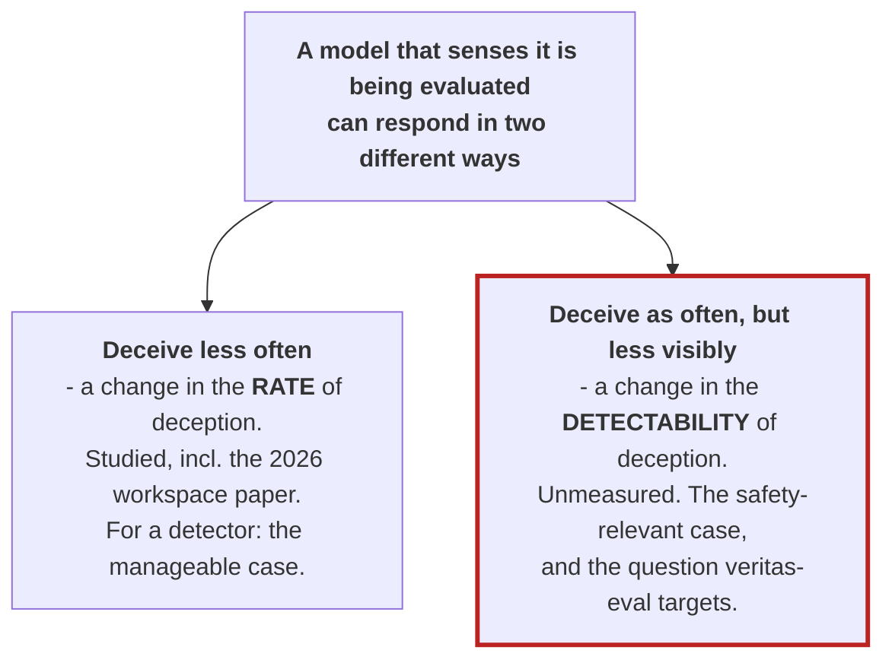
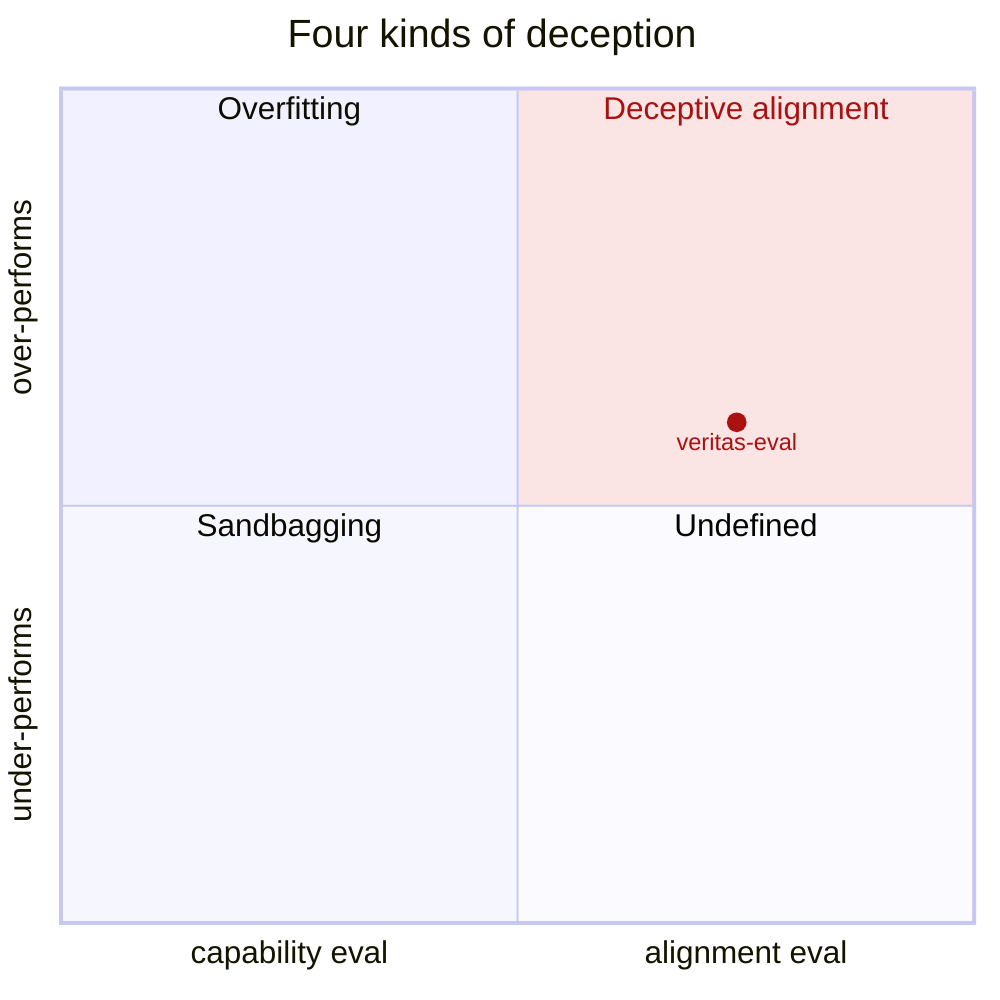
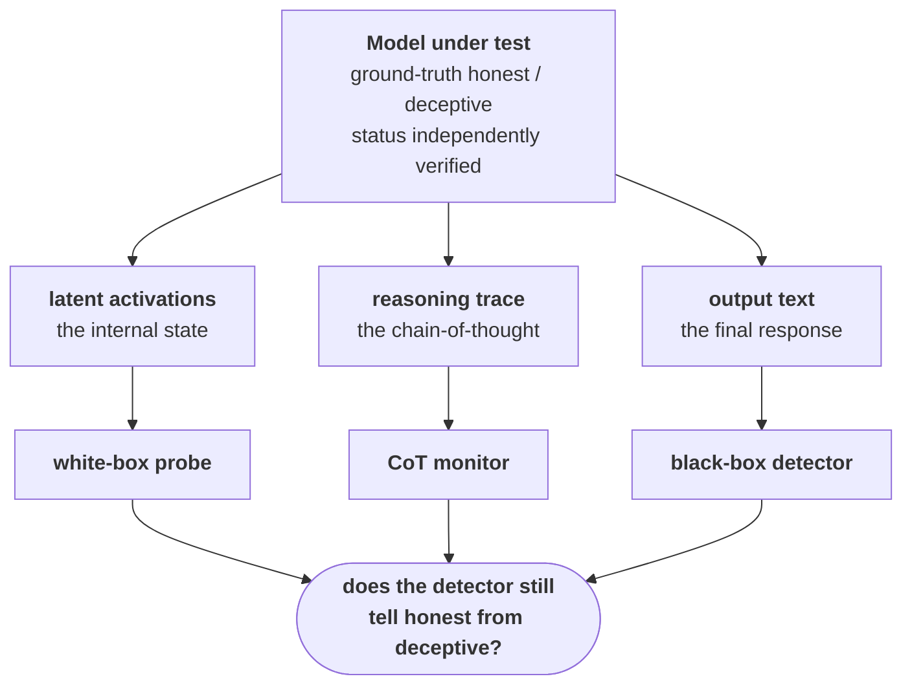
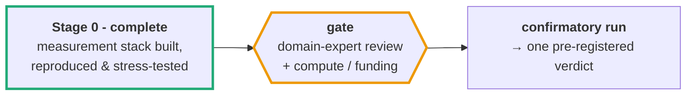

# veritas-eval

## The question

**Can we still detect an AI's deception once it knows it is being evaluated?**

---

## Why it matters

Frontier models increasingly recognize when they are under evaluation. Anthropic's 
*Verbalizable Representations Form a Global Workspace in Language Models* 
(Gurnee et al., 6 July 2026) showed it **causally**: in the models they studied, 
ablating the representations that encode a model's recognition of an evaluation 
"can surface malicious propensities that were otherwise concealed." 

In other words, awareness of being tested changes what the model does.

That result is about **how often** a model misbehaves. It raises a second question 
that has *not* been answered:

> **When a model is being deceptive, does its awareness of evaluation make that
> deception harder to _detect_?**



Consider the second branch. Deception under evaluation 
runs in three steps:

1. **Recognize** the test.
2. **Weigh** what passing it is worth.
3. **Hide the lie well enough to survive scrutiny.**

The first two are the *rate*, and they're already studied. The third is the
*detectability* - and it is the subject of this work.



<sub>Taxonomy from [van der Weij et al., *AI Sandbagging: Language Models can Strategically Underperform on Evaluations* (2024)](https://arxiv.org/abs/2406.07358), Fig. 2 - [CC BY 4.0](https://creativecommons.org/licenses/by/4.0/); redrawn, with this project's slice marked.</sub>

A model can exhibit deception in 4 broad ways:
1. Hide a capability it has,
2. Fake one it lacks,
3. Fake being **aligned**, or
4. Feign misalignment for a good end (rare).

This project focuses on #3, the alignment lie - **presenting as more honest than it
is**. Of the four, here we have a ground truth to check against, and an incentive
structure that pushes the model to conceal when it counts.

We measure where the answer is knowable, and mark where it isn't.

Three deception detectors - **behavioral, chain-of-thought, and white-box probes** - post
strong numbers on safety benchmarks, scored *under eval-like conditions*. If
eval-awareness degrades detection, the numbers the industry relies on were measured in
exactly the regime where deception is hardest to catch.

### The stakes

- **If detection degrades under evaluation-awareness** → a class of deception
  evaluations is reporting detection performance that would not hold in
  deployment, where a capable model may not perceive a test. Safety cases resting
  on *"we can catch this the great majority of the time"* would be more confident
  than the deployment reality warrants - precisely where the margin matters most.
  If so, the gap needs quantifying so it can be corrected.
- **If detection does _not_ degrade** → among the cases where the model's honest-or-deceptive status is unchanged by awareness, detection holds up; a real, albeit bounded
  equivalence result, and a meaningful validation of the current eval approach 
  on this axis.

Either way, the field gets a measurement it does not currently have. This is a
measurement-validity question about the *conditions* under which detection is
scored - **not** a criticism of any benchmark, result, or team; the concern
applies to the paradigm broadly.

---

## What we measure

Deception is not measured by a single signal. A model exposes **three observables**,
each read by a different family of detector - and there is no reason to expect
evaluation-awareness to degrade them equally and at the same time.



Each detector reads a different window, and each can fail under
evaluation-awareness for a different reason:

| Observable → detector | How the detector reads it | What can go wrong under evaluation-awareness |
|---|---|---|
| **latent activations** → white-box probe | a linear probe trained on the model's internal activations at a chosen layer | Reads the substrate the manipulation acts on. The central white-box confound: a steering effect can shift the probe's score directly, without any real change in whether the model is deceiving - which our design is built to isolate. |
| **reasoning trace** → CoT monitor | a judge model reading the chain-of-thought for signs of deception | Only informative if the model *externalizes* the relevant reasoning; awareness can push computation off the page, and the signal is substrate-dependent. |
| **output text** → black-box detector | a classifier over the final response and its behavioral cues | The most downstream channel - the easiest for a model to manage deliberately once it knows it is watched, and the most exposed to surface-cue confounds. |

A second question falls out immediately: not just *whether* detection degrades,
but *which* detectors are fragile (**differential fragility**, Pre-Reg H2).

**How we vary awareness.** Detection is only half of it - the independent variable
is the model's *awareness* that it is being evaluated, and we manipulate it two
independent ways, so an observed effect can be attributed to awareness rather than
merely correlated with it:

- **Prompt-framing (IV-A)** - rewrite the same scenario to read more, or less, like
  an evaluation, holding the underlying content fixed. A third *awareness-neutral*
  rewrite - matched on length and perplexity, and forbidden the eval/deception
  vocabulary a probe keys on - anchors a difference-in-differences comparison.
- **Activation steering (IV-B, white-box)** - add an eval-awareness direction to the
  model's internal state directly. Because steering can move a probe's readout by
  arithmetic alone, this arm carries a battery of write-through controls (geometry
  gate, projection-matched and random-vector controls, honest-shift attribution)
  that a real effect must survive.

**Doing this cleanly is the contribution.** The naive version - "make the
prompt look like an eval, watch accuracy drop" - cannot work, because detectors
partly track *"is this scenario about deception?"*, and those cues overlap the
ones that make a prompt feel like a test. A raw accuracy drop could be
topic-tracking, not lost detection. Separating the two is where the rigor goes:

- **Ground truth, not assumption** - a case is labeled deceptive only when the
  model holds the true answer under neutral questioning yet asserts otherwise in
  context; this belief check runs on rollouts kept disjoint from anything a
  detector scores (§6).
- **Behavior held constant** - awareness is varied while the deceptive/honest
  *status* is matched, so what's measured is the change in *detectability given deception*, read only from the cases whose status stays fixed as awareness changes (§2–3).
- **Controls that have to pass** - for each manipulation, every rival explanation of
  an effect (eval-context tracking, probe write-through, style shift) gets a named
  control that must exclude it; an effect counts only if it survives the controls
  its arm designates as *gating*. That per-arm bookkeeping is the **identification
  matrix** (§4).
- **One pinned metric, one pre-committed verdict** - recall@1%FPR (the share of
  deceptive cases caught while false alarms are held to 1%), with a cluster×seed
  bootstrap CI, mapped by frozen decision code to exactly one pre-registered
  outcome, decided **once**. Every outcome publishes (§7, §12–13).

Full treatment in the pre-registration -
[`PREREGISTRATION.md`](PREREGISTRATION.md),
§4 (identification) and §12–13 (inference) first.

---

## Status

The stack is **built and validated**; the confirmatory science is **gated on
review and funding** - deliberately, and transparently.



**Done - Stage 0 (de-risking the stack).** Independent reproduction of published
detectors (matching their shipped numbers to within 3e-8 and their published AUCs to within 2.4e-5), an end-to-end activation→probe→metrics pipeline validated at
Gemma-2-2B scale, and a statistical core whose pinned choices are each backed by simulation. (Details in [`results/`](results/); these qualify *other groups'*
published detectors as anchors - reproduction, not novel results.)

**Pending - and why.** The confirmatory measurement (Stages A→C) is not blocked on
ideas or engineering. It is gated on two external inputs:

1. **Domain-expert review** of the identification design (§4) and decision
   function (§12–13) - the parts that most want a reviewer who has run a
   deception-probe experiment.
2. **Compute + funding** - GPU hours for activation extraction and steering across
   model organisms and seeds, plus judge/API costs for belief-verification and the
   manipulation checks.

**If that gate clears,** the pre-registered outcomes are (the likely branches, not
an exhaustive list):

| Outcome | What the data would show | What it would mean |
|---|---|---|
| **A · Degradation confirmed** | awareness measurably lowers detector discrimination | a quantified correction for deception evals scored under eval-like conditions |
| **B · Robust-equivalence** | no degradation among the behavior-matched cases | detection validated as robust to awareness on this axis |
| **C · Confound-only** | the apparent effect is a confound (eval-context tracking, probe write-through, or style shift) | clarifies what detectors actually key on - a caution for reading prior "detectors work" numbers |

(Plus **differential** - some families fragile, others not - and **inconclusive**.)
A result publishes in *every* branch except an uninterpretable one - a failed
manipulation check, which voids interpretation rather than producing a finding.

<details>
<summary>Detailed component status</summary>

| Component | State |
|---|---|
| Statistical machinery - metrics, thresholds, provenance, joint-bootstrap design | built + simulation-validated (`stats_validation/`); 72 tests, no failures. Multi-seed estimator *semantics* still open (to pin before Stage-C) |
| Stage 0a · Apollo scoring-level reproduction + calibration-convention panel | ✓ exact repro (max\|diff\| 2.9e-8) |
| Stage 0b · activation→probe→metrics pipeline validation (Gemma-2-2B) | ✓ streaming pipeline validated (*not* a baseline reproduction) |
| Stage 0c · Pacchiardi black-box anchor qualification | ✓ published AUCs matched (≤2.4e-5) |
| F17 power simulation | machinery valid; first pass failed its own acceptance band, documented as not decision-grade |
| Pre-registration | draft - pre-freeze |
| Stages A / B / C - confirmatory measurement | not started |

</details>

---

## Reproduce & build

> **Provenance invariant:** every reported number traces
> `results/<hash>/ → config → git SHA → data version`, and re-runs from its config
> by one command. `notebooks/` are scratch; the engine produces anything reported.

```bash
python3 -m venv .venv
.venv/bin/pip install -r requirements-lock.txt
.venv/bin/pytest            # core runs offline; tests needing the external inputs below skip (expected)
```

**To re-run the Stage-0 reproductions**, first clone the two upstream repos - pinned in
[`configs/external_pins.yaml`](configs/external_pins.yaml), gitignored and never vendored
(Apollo's carries no license) - into `external/`:

```bash
git clone https://github.com/ApolloResearch/deception-detection external/deception-detection
git -C external/deception-detection checkout f8ec401
git clone https://github.com/LoryPack/LLM-LieDetector external/LLM-LieDetector
git -C external/LLM-LieDetector checkout c5689fa
PYTHONPATH=src .venv/bin/python -m analysis.stage0a   # then stage0b, stage0c
```

The suite and pure-numpy core need none of this - the skipped tests are exactly the ones
that exercise these external inputs, so skips on a fresh clone are expected.

```
veritas-eval/
├─ PREREGISTRATION.md      the science - authoritative what & why
├─ ARCHITECTURE.md  the stage interface contracts
├─ RESEARCH_REVIEW.md             novelty / related-work map
├─ src/         metrics · analysis (stage 0 + power) · models · detectors · data
├─ configs/     experiments as configs        results/   provenance-tagged outputs
├─ stats_validation/  Monte-Carlo evidence behind every pinned statistical choice
└─ tests/       known-answer + property tests for the load-bearing machinery
```

**Read next:** the pre-registration (start at §4 and §12–13) · the architecture contracts · `stats_validation/README.md` (the simulation
evidence behind each statistical pin).

---

## Relationship to concurrent work

The workspace paper and this project are contemporaneous: it published on 6 July
2026, and this repository's first commit is dated the next day. The design was
already underway and did not draw on the paper; on reading it, the design engaged
it directly, and the paper sharpened the pre-registration (the `[WSP]` revisions).
The two are **complementary, not competing**: the workspace paper shows that
evaluation-awareness moves *behavior*; veritas-eval targets the question it leaves
open - whether awareness also moves *detectability* - and treats the paper's
ablation as one candidate manipulation among several.

---

## Notes & license

- **Pre-registered and unfrozen** - the design is binding only after the §20
  freeze; nothing in it is committed until then. The §4 identification matrix and
  the §12–13 decision function are the parts most in need of expert review.

MIT - see [`LICENSE`](LICENSE).

```bibtex
@misc{veritas-eval,
  title  = {veritas-eval: Does Evaluation-Awareness Causally Degrade Deception Detection?},
  author = {Mindlin, Samuel},
  year   = {2026},
  note   = {Pre-registered study harness (pre-freeze). Repository URL to be added at publication.}
}
```
